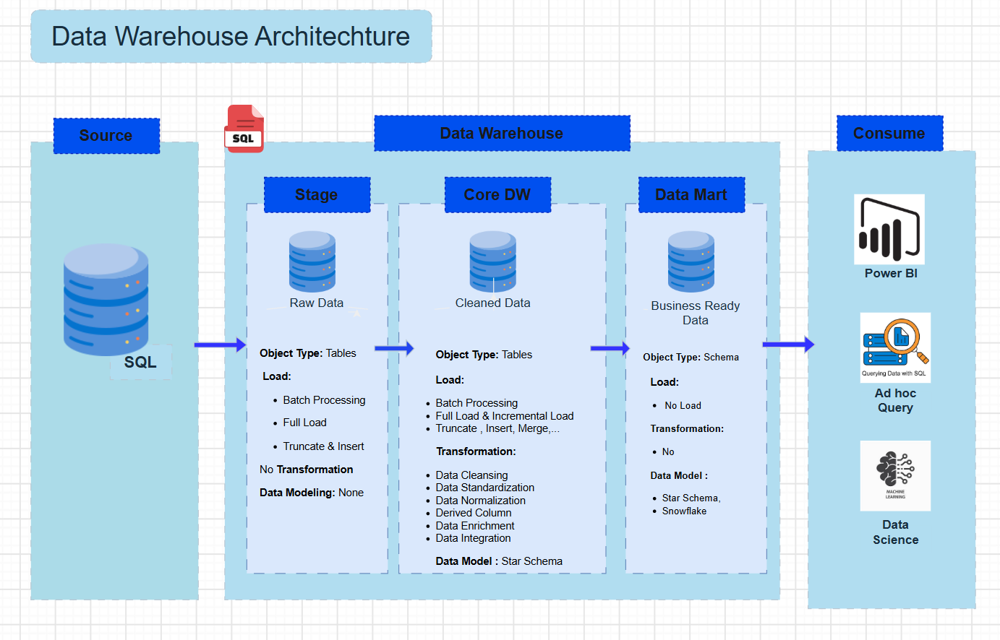
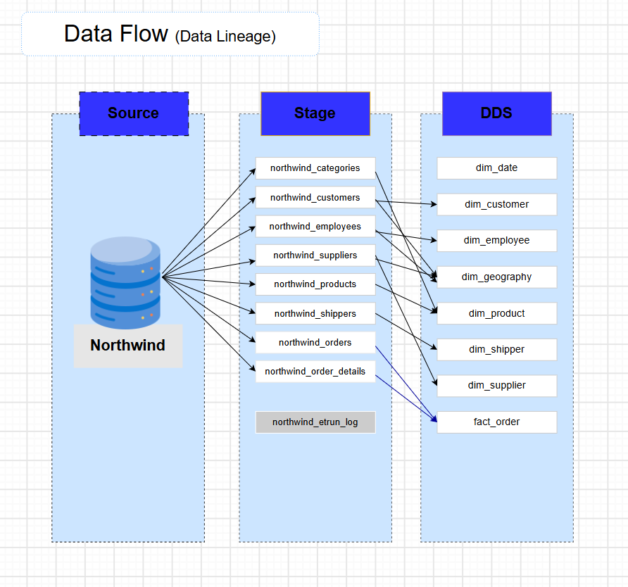
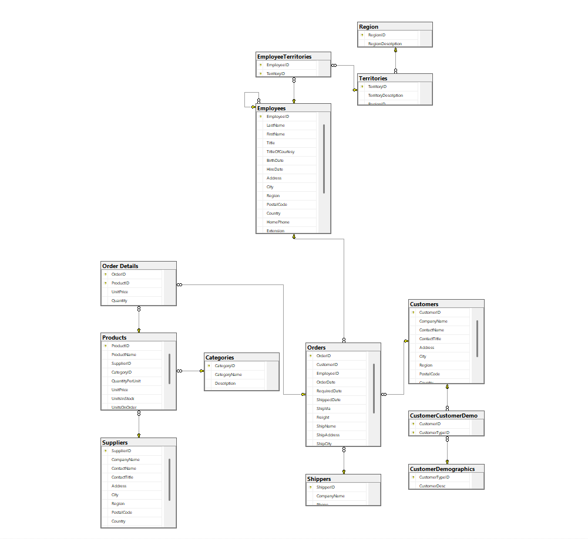
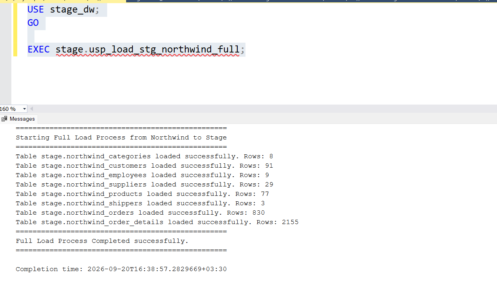
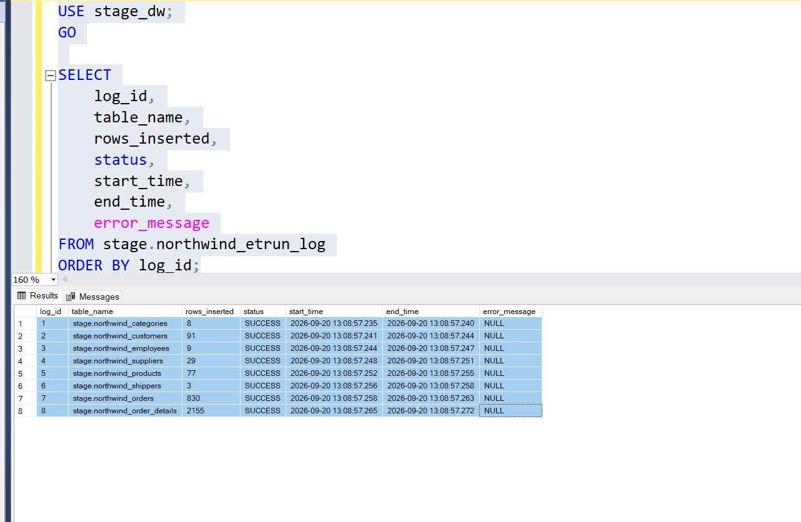
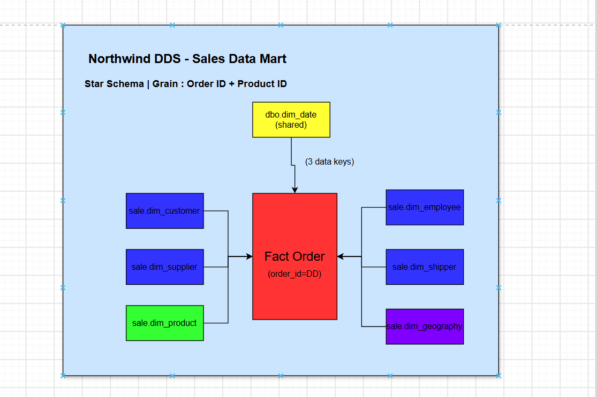

# Northwind Data Warehouse

An end-to-end **Business Intelligence and Data Warehouse project** built with **Microsoft SQL Server** and **T-SQL**.

The project transforms the classic **Northwind OLTP database** into an analytics-ready **Sales Data Mart** using a layered Data Warehouse architecture and a **Star Schema** dimensional model.

**Author:** Mahdieh Karimi
**Role:** Data Warehouse Developer
**Platform:** Microsoft SQL Server
**Language:** T-SQL
**Architecture:** Source → Stage → DDS → Consume
**Model:** Star Schema
**Version:** 1.0.0
**Last Updated:** 2026-09-24

---

## Table of Contents

1. [Overview](#1-overview)
2. [Architecture](#2-architecture)
3. [Architecture Diagram](#3-architecture-diagram)
4. [Data Flow](#4-data-flow)
5. [Source Database](#5-source-database)
6. [Staging Layer](#6-staging-layer)
7. [DDS Layer — Star Schema](#7-dds-layer--star-schema)
8. [Star Schema Diagram](#8-star-schema-diagram)
9. [Project Structure](#9-project-structure)
10. [Technologies](#10-technologies)
11. [Documentation](#11-documentation)
12. [Execution Guide](#12-execution-guide)
13. [Data Quality](#13-data-quality)
14. [KPIs](#14-kpis)
15. [ETL Stored Procedures](#16-etl-stored-procedures)
16. [Unknown Members](#17-unknown-members)
17. [Data Dictionary](#18-data-dictionary)
18. [Security and Governance](#19-security-and-governance)

---

## 1. Overview

The **Northwind Data Warehouse** is an end-to-end BI project that transforms the classic Northwind transactional database into a structured and analytics-ready Data Warehouse.

The project demonstrates:

* Layered Data Warehouse architecture
* T-SQL-based ETL pipeline
* Staging and data cleansing
* Dimensional modeling
* Star Schema design
* Slowly Changing Dimension (SCD) Type 1
* Surrogate keys
* Unknown Members
* Data quality validation
* ETL logging and error handling
* Dual-calendar Date Dimension (Gregorian + Shamsi)
* Sales Data Mart design

The final output is a business-ready **Sales Data Mart** that can be consumed by **Power BI, SQL queries, or Data Science workloads**.

---

## 2. Architecture

The project follows a four-layer architecture:

```text
┌──────────────────────────┐
│     Source Database      │
│      Northwind OLTP      │
└────────────┬─────────────┘
             │
             ▼
┌──────────────────────────┐
│      Staging Layer       │
│       stage_dw.stage     │
│                          │
│ Raw Data + Audit         │
└────────────┬─────────────┘
             │
             ▼
┌──────────────────────────┐
│          DDS             │
│        Core DW           │
│                          │
│ Data Cleaning            │
│ Standardization          │
│ Transformation           │
│ Integration              │
└────────────┬─────────────┘
             │
             ▼
┌──────────────────────────┐
│       Sales Data Mart    │
│        Star Schema       │
│                          │
│  Dimensions + Fact       │
└────────────┬─────────────┘
             │
             ▼
┌──────────────────────────┐
│         Consume          │
│                          │
│ Power BI / SQL / DS      │
└──────────────────────────┘
```

### Layer Responsibilities

| Layer   | Database    | Schema  | Responsibility               | Load Strategy          |
| ------- | ----------- | ------- | ---------------------------- | ---------------------- |
| Source  | `Northwind` | `dbo`   | OLTP source system           | —                      |
| Stage   | `stage_dw`  | `stage` | Raw replica + audit metadata | Full Load              |
| DDS     | `dds`       | `sale`  | Cleaned dimensional model    | SCD Type 1 / Full Load |
| Consume | —           | —       | Analytics and reporting      | —                      |

The architecture separates **data ingestion, transformation, dimensional modeling, and consumption**, making the pipeline easier to maintain and extend.

---

## 3. Architecture Diagram



The architecture diagram represents the complete data flow from the Northwind source system to the final consumption layer.

The DDS/Core DW area contains:

* **Stage** — Raw source data
* **Core DW** — Cleaning, standardization, integration, and transformation
* **Data Mart** — Business-ready Star Schema

---

## 4. Data Flow



The project implements the following data lineage:

```text
Northwind OLTP
      │
      ▼
Stage
      │
      ▼
DDS / Core DW
      │
      ├── Dimensions
      │
      └── Fact
      │
      ▼
Sales Data Mart
      │
      ▼
Power BI / SQL / Data Science
```

### Staging Tables

The staging layer contains:

* `northwind_categories`
* `northwind_customers`
* `northwind_employees`
* `northwind_suppliers`
* `northwind_products`
* `northwind_shippers`
* `northwind_orders`
* `northwind_order_details`
* `northwind_etrun_log`

### DDS Objects

The Sales Data Mart contains:

**Dimensions:**

* `dim_date`
* `dim_customer`
* `dim_employee`
* `dim_geography`
* `dim_product`
* `dim_shipper`
* `dim_supplier`

**Fact:**

* `fact_order`

---

## 5. Source Database



The project uses the classic **Northwind** database as its OLTP source.

### Tables Used

| Table           | Purpose              |
| --------------- | -------------------- |
| `Customers`     | Customer master data |
| `Employees`     | Employee master data |
| `Suppliers`     | Supplier master data |
| `Products`      | Product master data  |
| `Categories`    | Product categories   |
| `Shippers`      | Shipping companies   |
| `Orders`        | Order headers        |
| `Order Details` | Order line items     |

Other Northwind tables are outside the scope of the Sales Data Mart.

---

## 6. Staging Layer

The staging layer is implemented in the `stage_dw` database under the `stage` schema.

Its primary purpose is to provide a controlled landing area between the OLTP source and the Data Warehouse.

### Characteristics

| Feature          | Implementation                      |
| ---------------- | ----------------------------------- |
| Database         | `stage_dw`                          |
| Schema           | `stage`                             |
| Load Pattern     | Full Load                           |
| Loading Method   | `TRUNCATE + INSERT`                 |
| Audit Column     | `dwh_inserted_at`                   |
| Logging          | `stage.northwind_etrun_log`         |
| Stored Procedure | `stage.usp_load_stg_northwind_full` |

### Staging Process

```text
Source Table
     │
     ▼
TRUNCATE Stage Table
     │
     ▼
INSERT Source Data
     │
     ▼
Record Execution Log
```

Each staging table is loaded independently using `TRY/CATCH` error handling.



### ETL Execution Log



The execution log records:

* Package name
* Table name
* Rows inserted
* Execution status
* Start time
* End time
* Error message

This provides traceability and auditability for the staging process.

---

## 7. DDS Layer — Star Schema

The DDS layer contains the final **Sales Data Mart**.

The dimensional model consists of **7 dimensions and 1 fact table**.

### Dimensions

| Dimension       | Grain                       | SCD    | Description                   |
| --------------- | --------------------------- | ------ | ----------------------------- |
| `dim_customer`  | One row per customer        | Type 1 | Customer attributes           |
| `dim_employee`  | One row per employee        | Type 1 | Employee attributes           |
| `dim_supplier`  | One row per supplier        | Type 1 | Supplier attributes           |
| `dim_product`   | One row per product         | Type 1 | Product + category attributes |
| `dim_shipper`   | One row per shipper         | Type 1 | Shipping company              |
| `dim_geography` | One row per unique location | —      | Integrated geography          |
| `dim_date`      | One row per day             | —      | Shared date dimension         |

### Fact Table

| Fact         | Grain                               | Load Strategy |
| ------------ | ----------------------------------- | ------------- |
| `fact_order` | One row per `order_id + product_id` | Full Load     |

### Fact Measures

The fact table contains the following analytical measures:

* `unit_price`
* `quantity`
* `discount_rate`
* `gross_amount`
* `discount_amount`
* `net_amount`
* `freight_amount`

### Key Modeling Decisions

* Category is **denormalized** into `dim_product`.
* No separate `dim_category` is created.
* Geography is integrated from multiple staging sources.
* `order_id` is treated as a **Degenerate Dimension**.
* Surrogate keys are used for dimensions.
* Unknown Members use surrogate key `0`.
* `dim_date` is shared across the fact table.
* The Date Dimension supports both **Gregorian and Shamsi calendars**.

---

## 8. Star Schema Diagram



The final Sales Data Mart follows a **Star Schema**.

```text
                         dim_customer
                              │
                              │
dim_employee ──────── fact_order ──────── dim_product
                              │
                              │
                     dim_geography
                              │
              ┌───────────────┼───────────────┐
              │               │               │
        dim_supplier     dim_shipper       dim_date
```

### Fact Table Grain

The grain of `fact_order` is:

> **One row per Order ID + Product ID**

This grain allows analysis of sales at the individual order-line level.

---

## 9. Project Structure

```text
Data-Warehouse-with-SSMS/
│
├── docs/
│   ├── DATA_CATALOG.md
│   └── SOURCE_ANALYSIS.md
│
├── screenshots/
│   ├── core_dw.png
│   ├── data_flow.png
│   ├── data_warehouse_architecture.png
│   ├── source_data_diagram.png
│   ├── staging_load_execution.png
│   └── staging_load_log.png
│
├── sql/
│   ├── Core DW 01-Northwind_Sale_CreateTables.sql
│   ├── Core DW 02-usp_load_dim_northwind.sql
│   ├── Core DW 03-usp_load_fact_order_full.sql
│   ├── Core DW DimDate.sql
│   ├── northwind_source.sql
│   ├── Stage 01-Create Tables and DB.sql
│   ├── Stage 02- Insert into Stage.sql
│   └── Stage 03-SP_LoadStage.sql
│
└── README.md
```

---

## 10. Technologies

* **Microsoft SQL Server** — Database engine
* **T-SQL** — ETL and transformation logic
* **SQL Server Management Studio (SSMS)** — Development environment
* **Star Schema** — Dimensional modeling
* **draw.io** — Architecture and Data Warehouse diagrams
* **Git & GitHub** — Version control

---

## 11. Documentation

Detailed documentation is available in the `docs/` directory.

### Data Catalog

[`docs/DATA_CATALOG.md`](docs/DATA_CATALOG.md)

Contains metadata and definitions for the Data Warehouse tables and columns.

### Source Analysis

[`docs/SOURCE_ANALYSIS.md`](docs/SOURCE_ANALYSIS.md)

Contains the analysis of the Northwind source database and the tables used by the Data Warehouse.

---

## 12. Execution Guide

Execute the SQL scripts in the following order.

### Step 1 — Source Database

Execute:

```text
sql/northwind_source.sql
```

This creates or restores the Northwind source database.

### Step 2 — Staging Layer

Create the staging database and tables:

```text
sql/Stage 01-Create Tables and DB.sql
```

Optional direct data loading:

```text
sql/Stage 02- Insert into Stage.sql
```

Create the staging stored procedure:

```text
sql/Stage 03-SP_LoadStage.sql
```

Execute:

```sql
EXEC stage.usp_load_stg_northwind_full;
```

### Step 3 — DDS Dimensions

Create the Data Warehouse tables:

```text
sql/Core DW 01-Northwind_Sale_CreateTables.sql
```

Create the Date Dimension:

```text
sql/Core DW DimDate.sql
```

Create the dimension loading procedure:

```text
sql/Core DW 02-usp_load_dim_northwind.sql
```

Execute:

```sql
EXEC sale.usp_load_dim_northwind;
```

### Step 4 — Fact Table

Create the fact loading procedure:

```text
sql/Core DW 03-usp_load_fact_order_full.sql
```

Execute:

```sql
EXEC sale.usp_load_fact_order_full;
```

---

## 13. Data Quality

The ETL pipeline applies several data quality and cleansing rules before loading the final Data Mart.

### Text Cleansing

```sql
COALESCE(
    NULLIF(LTRIM(RTRIM(SourceColumn)), N''),
    N'Unknown'
)
```

Used to:

* Remove leading/trailing spaces
* Convert empty strings to `NULL`
* Replace missing values with defined defaults

### Numeric Validation

* `quantity > 0`
* `unit_price >= 0`
* Discount rate normalized to the range `0–1`

### Deduplication

Duplicate source records are handled using:

```sql
ROW_NUMBER()
```

### Geography Standardization

Geographical values are standardized using:

```sql
UPPER(LTRIM(RTRIM(country)))
```

### Grain Validation

Unique constraints and validation logic are used to maintain the defined fact-table grain.

---

## 14. KPIs

The Sales Data Mart supports common business metrics such as:

| KPI                   | Formula                           |
| --------------------- | --------------------------------- |
| Gross Sales           | `SUM(gross_amount)`               |
| Net Sales             | `SUM(net_amount)`                 |
| Total Discount        | `SUM(discount_amount)`            |
| Total Quantity Sold   | `SUM(quantity)`                   |
| Average Selling Price | `SUM(net_amount) / SUM(quantity)` |
| Order Count           | `COUNT(DISTINCT order_id)`        |
| Customer Count        | `COUNT(DISTINCT customer_key)`    |
| Product Count         | `COUNT(DISTINCT product_key)`     |
| Freight Cost          | `SUM(freight_amount)`             |

These measures can be used directly in SQL queries or exposed to Power BI.

---


## 15. ETL Stored Procedures

### Staging

```text
stage.usp_load_stg_northwind_full
```

Responsibilities:

1. Truncate staging tables
2. Load data from Northwind
3. Record execution results
4. Handle table-level errors

### Dimensions

```text
sale.usp_load_dim_northwind
```

Responsibilities:

* Clean source data
* Deduplicate records
* Integrate multiple sources
* Apply SCD Type 1 logic
* Generate and resolve surrogate keys
* Populate dimensions

### Fact

```text
sale.usp_load_fact_order_full
```

Responsibilities:

1. Truncate the fact table
2. Deduplicate source data
3. Clean and standardize values
4. Maintain fact grain
5. Resolve dimension surrogate keys
6. Map dates to `dim_date`
7. Calculate financial measures
8. Insert validated records

### Transaction Management

ETL procedures use transaction control and error handling:

```sql
SET NOCOUNT ON;
SET XACT_ABORT ON;

BEGIN TRY
    BEGIN TRANSACTION;

    -- ETL operations

    COMMIT TRANSACTION;
END TRY
BEGIN CATCH

    IF @@TRANCOUNT > 0
        ROLLBACK TRANSACTION;

    THROW;
END CATCH;
```

This provides controlled transaction handling and error propagation.

---

## 16. Unknown Members

All dimensions contain an **Unknown Member** with surrogate key `0`.

| Dimension       | Unknown Key |
| --------------- | ----------: |
| `dim_customer`  |         `0` |
| `dim_employee`  |         `0` |
| `dim_supplier`  |         `0` |
| `dim_product`   |         `0` |
| `dim_shipper`   |         `0` |
| `dim_geography` |         `0` |

Unknown Members prevent fact-loading failures when a source record contains a missing or unmatched dimension value.

Example:

```sql
COALESCE(dc.customer_key, 0) AS customer_key
```

---

## 17. Data Dictionary

### Fact — `sale.fact_order`

| Column              | Description             |
| ------------------- | ----------------------- |
| `order_fact_key`    | Surrogate primary key   |
| `order_id`          | Degenerate business key |
| `source_product_id` | Product business key    |
| `customer_key`      | Customer dimension FK   |
| `employee_key`      | Employee dimension FK   |
| `supplier_key`      | Supplier dimension FK   |
| `product_key`       | Product dimension FK    |
| `shipper_key`       | Shipper dimension FK    |
| `geography_key`     | Geography dimension FK  |
| `order_date_key`    | Order date FK           |
| `required_date_key` | Required date FK        |
| `shipped_date_key`  | Shipped date FK         |
| `unit_price`        | Unit price              |
| `quantity`          | Ordered quantity        |
| `discount_rate`     | Discount rate           |
| `gross_amount`      | Gross sales amount      |
| `discount_amount`   | Discount amount         |
| `net_amount`        | Net sales amount        |
| `freight_amount`    | Allocated freight       |
| `dwh_inserted_at`   | ETL audit timestamp     |

### Dimensions

The main dimensions are:

* `sale.dim_customer`
* `sale.dim_employee`
* `sale.dim_supplier`
* `sale.dim_product`
* `sale.dim_shipper`
* `sale.dim_geography`
* `dbo.dim_date`

For complete column-level metadata, see:

[`docs/DATA_CATALOG.md`](docs/DATA_CATALOG.md)

---

## 18. Security and Governance

The project identifies several fields as potentially sensitive and demonstrates basic governance considerations.

### Sensitive Fields

Examples include:

* Customer phone
* Customer fax
* Employee names
* Supplier phone
* Contact information

### Security Principles

* Apply least-privilege access
* Restrict direct access to staging tables
* Protect sensitive information
* Use curated reporting views for consumers
* Never store credentials or secrets in the repository

---

## Acknowledgements

* **Northwind** — Microsoft sample database used as the source system
* **Kimball Dimensional Modeling** — Dimensional modeling principles
* **draw.io** — Architecture and Data Warehouse diagrams
* **SQL Server Management Studio (SSMS)** — Development environment

---

## Author

**Mahdieh Karimi**
Data Warehouse Developer

**Repository:** `Data-Warehouse-with-SSMS`

---

**Version:** 1.0.0
**Last Updated:** 2026-09-24
